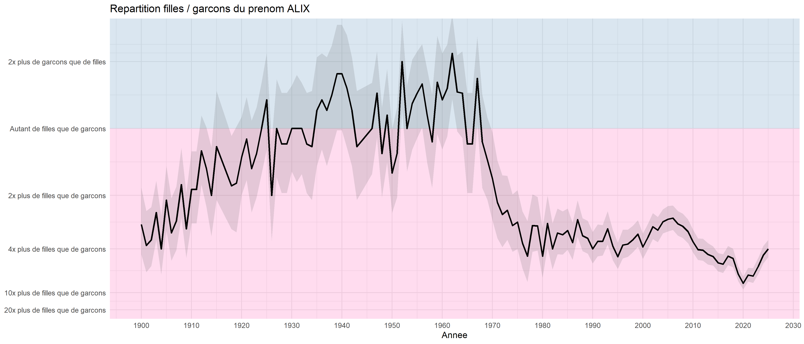
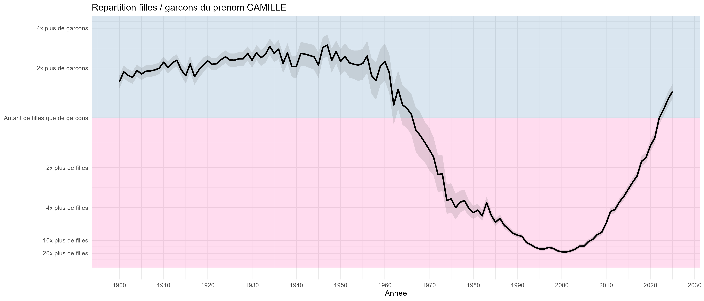
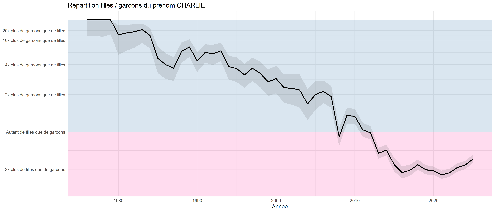
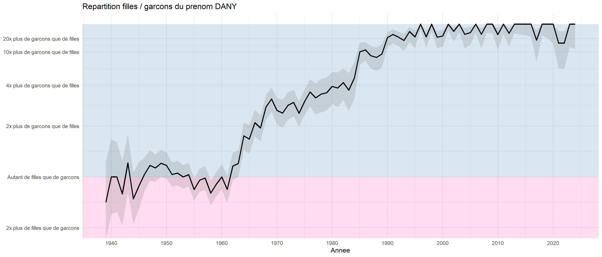
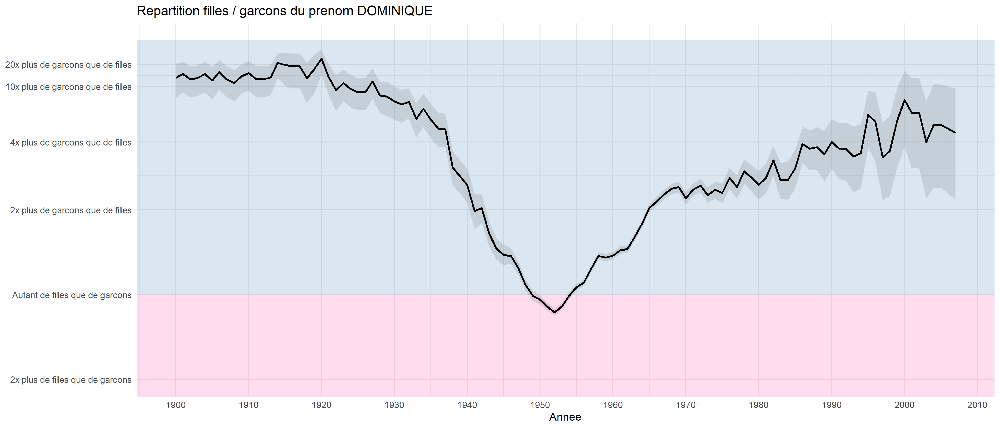
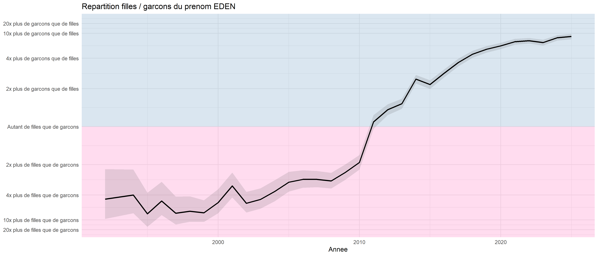
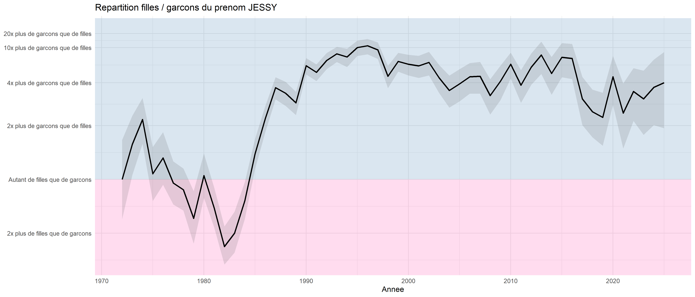
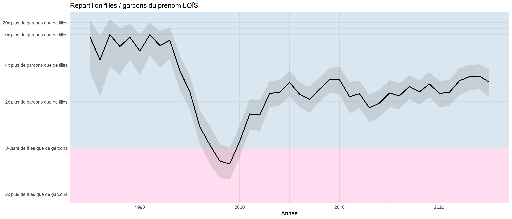
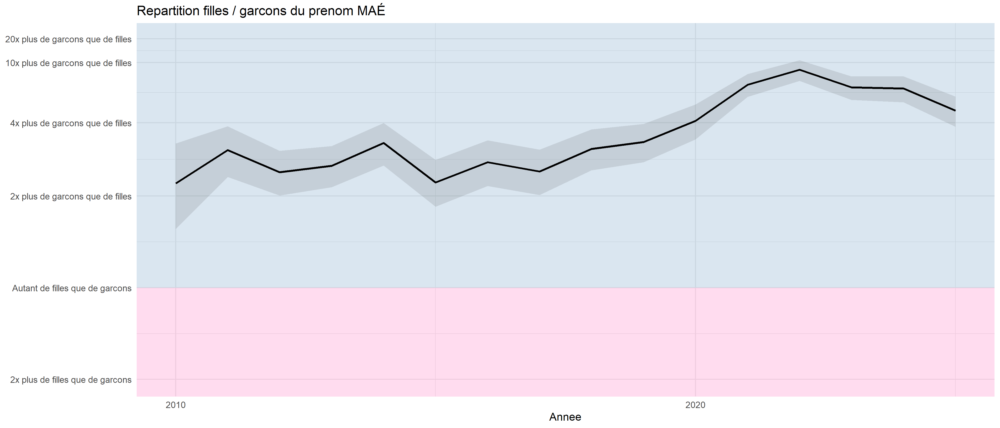

On connaît les prénoms qui peuvent être donnés indépendamment aux garçons et aux filles sans que cela ne choque trop (on pensera au classique « Dominique »), la règle étant que le prénom s'écrive de la même façon (exit donc la comparaison Pascale/Pascal).

Il peut être intéressant de regarder l'ensemble des prénoms qui ont été donnés aux deux sexes. Pour ce faire, on utilise les données de l'INSEE qui liste pour chaque année le nombre de fois où chaque prénom a été donné en France pour chacun des sexes, année par année depuis 1900 (à condition que celui-ci ne soit pas trop rare : au moins donné 3 fois).

## Fréquence et ratio

Il y a deux choses à regarder pour ces prénoms : leur fréquence totale et le ratio du nombre de fois où ce prénom a été donné à un garçon par rapport au nombre de fois où il a été donné à une fille. Dans le meilleur des cas, ce ratio est de 1 (autant de garçons que de filles portent ce prénom). On peut considérer que jusqu'à un ratio de 5 ou 6, on reste dans des rapports raisonnables — le prénom peut encore être considéré comme unisexe.

En se limitant aux prénoms donnés depuis 2000 (données récentes), avec un bon ratio (inférieur à 6) et un nombre important d'occurrences (au moins 4 000 fois), on obtient notamment :

| Prénom | Nb Garçons | Nb Filles | Ratio |
|--------|-----------|----------|-------|
| Alix | 3 373 | 11 983 | 3.6 |
| Charlie | 6 173 | 6 934 | 1.1 |
| Eden | 10 903 | 8 325 | 1.3 |
| Jessy | 3 972 | 839 | 4.7 |
| Loïs | 4 521 | 2 058 | 2.2 |
| Maé | 1 766 | 2 726 | 1.5 |
| Sasha | 7 548 | 5 734 | 1.3 |

Quand les ratios sont beaucoup plus élevés, les prénoms sont quasi exclusivement attribués à un seul sexe. À noter que la précision du calcul est moins fiable dans ces cas, l'INSEE ne comptabilisant pas les années où un prénom a été donné moins de 3 fois — ce qui biaise légèrement les résultats.

## Les prénoms qui changent de sexe

Une information encore plus intéressante : l'évolution de l'attribution de certains prénoms au fil du temps. En ne gardant que les prénoms donnés assez fréquemment (au moins 500 fois à chaque sexe), on peut représenter graphiquement l'évolution de la proportion de filles et de garçons à qui ces prénoms ont été attribués.

Les graphiques se lisent ainsi : en abscisse les années, en ordonnée la proportion garçons/filles sur une échelle symétrique. La ligne centrale représente la parité parfaite. La zone bleue indique une majorité de garçons, la zone rose une majorité de filles. Les intervalles de confiance (zone grise) sont particulièrement utiles pour les petits effectifs.

---

### ALIX

Prénom actuellement plutôt féminin (environ 4 fois plus de filles que de garçons), sauf durant une période entre 1930 et 1960 où le rapport était plus équilibré.

---

### CAMILLE

Prénom extrêmement fréquent (plusieurs milliers de naissances par an depuis les années 1980) qui était plutôt masculin jusqu'en 1960 — deux Camille sur trois étaient des garçons. Il est devenu très féminin dans les années 2000 (20 fois plus de filles que de garçons), puis semble amorcer un retour vers la parité.

---

### CHARLIE

Prénom anciennement très masculin dans les années 1980–90, devenu plus féminin depuis 2000. Aujourd'hui la parité est presque atteinte.

---

### DANY

Prénom plutôt rare jusque dans les années 1940, avec une forte augmentation dans les années 1950. Depuis les années 1960, ce prénom devient de plus en plus masculin : il y a désormais environ 20 fois plus de garçons que de filles.

---

### DOMINIQUE

Prénom relativement fréquent et très masculin jusque dans les années 1940 (500 naissances par an), il a explosé dans les années 1950–60 avec plus de 20 000 enfants par an et une répartition proche du 50/50. Depuis, il est retourné dans un certain anonymat et est de nouveau principalement porté par des garçons.

---

### EDEN

Prénom en forte croissance dont le nombre d'occurrences augmente fortement depuis les années 2000, avec une tendance à se « masculiniser » depuis 2010.

---

### JESSY

Prénom à dominante masculine mais avec une part féminine non négligeable, en particulier dans les années 1990–2000.

---

### LOÏS

Prénom discret mais remarquablement équilibré sur les dernières décennies, avec une légère tendance féminine récente.

---

### MAÉ

Prénom récent avec une part féminine légèrement majoritaire, mais qui reste relativement mixte depuis son apparition.

---

## Source

Données : [INSEE — Fichier des prénoms](https://www.insee.fr/fr/statistiques/7633685), édition 2025.  
Code source : disponible sur [GitHub](https://github.com/AAudes/Prenom_genre).
