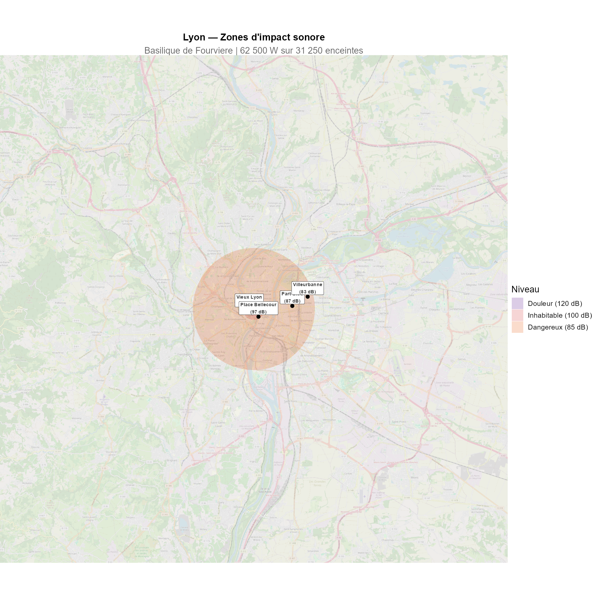
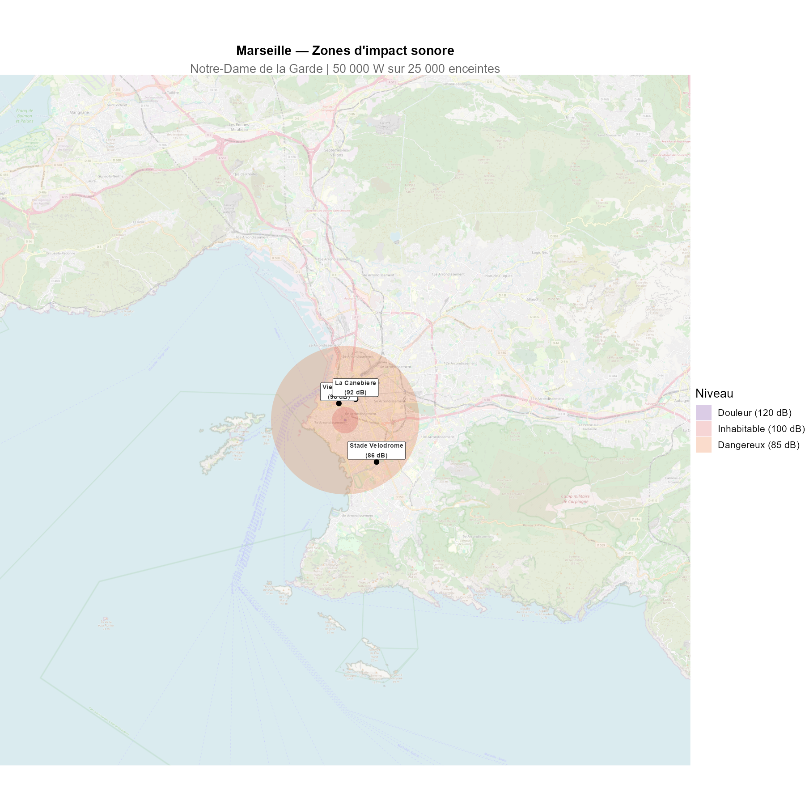

On connait le temps d'ecoute annuel de Spotify en France : des millions d'heures de musique chaque jour. Mais que se passerait-il si on rendait tout ca **physiquement audible** ? Si on accrochait a la Tour Eiffel suffisamment d'enceintes pour diffuser en continu, 24h/24, la totalite de ce qui est ecoute en France sur Spotify ?

C'est l'experience de pensee que l'on se propose de mener ici, etape par etape, en suivant la physique la ou elle nous mene.

## Combien d'enceintes sur la Tour Eiffel ?

### Le temps d'ecoute Spotify en France

Spotify compte environ **24 millions d'utilisateurs actifs mensuels** en France. Chaque utilisateur ecoute en moyenne **30 minutes par jour**. Cela represente :

- **12 millions d'heures** d'ecoute par jour
- soit **4,4 milliards d'heures** par an

Pour diffuser l'integralite de ces ecoutes en continu sur 24 heures, il faut autant de flux simultanes que d'heures divisees par 24 : environ **500 000 flux simultanes**.

Chaque flux necessite une enceinte. On choisit un modele modeste : **2 watts** par enceinte.

### La puissance totale

Avec 500 000 enceintes de 2W, on obtient une puissance acoustique totale de **1 000 000 watts** -- soit un million de watts, ou encore **20 fois** la puissance d'un concert rock geant.

### Est-ce que ca rentre sur la Tour Eiffel ?

Chaque enceinte occupe environ 10 x 10 cm. La structure metallique de la Tour Eiffel offre environ 25 000 m² de surface. Les 500 000 enceintes necessitent 5 000 m² : **ca rentre**, on n'utilise que 20% de la surface disponible. Cote poids, les 75 tonnes d'enceintes representent a peine 1% du poids de la tour (7 300 tonnes). La faisabilite physique n'est pas le probleme.

Le probleme, c'est le bruit.

---

## L'intensite sonore : un mur de son

### Le modele

On modelise la Tour Eiffel comme une **source ponctuelle omnidirectionnelle**. L'intensite sonore decroit en $1/r^2$ (loi de l'inverse du carre) :

$$L(r) = 10 \cdot \log_{10}\left(\frac{P_{total}}{4\pi r^2 \cdot I_0}\right) \quad \text{avec } I_0 = 10^{-12} \text{ W/m}^2$$

### Les resultats

| Lieu | Distance | Niveau sonore |
|------|----------|---------------|
| Pied de la Tour | 50 m | ~147 dB |
| Trocadero | 500 m | ~127 dB |
| Arc de Triomphe | 3 km | ~111 dB |
| Peripherique | 6 km | ~105 dB |
| Versailles | 17 km | ~96 dB |

Au pied de la Tour, on depasse la **rupture du tympan** (150 dB). Au Trocadero, c'est au-dessus du **seuil de douleur**. A l'Arc de Triomphe, c'est l'equivalent d'un concert a pleine puissance -- en continu. Meme au peripherique, le niveau reste dangereux pour l'audition.

### Attenuation avec la distance

Il faut s'eloigner a pres de **20 km** de la Tour pour retrouver un niveau comparable a celui d'une conversation normale (60 dB). Paris intra-muros est, en entier, au-dessus du seuil de danger.

---

## L'immobilier parisien s'effondre

### Le modele de depreciation

Les etudes economiques montrent qu'une augmentation du bruit au-dela de 55 dB entraine une depreciation d'environ **0,9% par decibel supplementaire** sur les prix immobiliers. Au-dela de 100 dB, on considere un bien comme **inhabitable** : sa valeur tombe a zero.

### Le resultat

Tous les arrondissements de Paris deviennent inhabitables ou presque. Les beaux quartiers du 7e, 16e et 6e -- parmi les plus chers de France -- voient leur valeur tomber a **zero**. Meme en banlieue proche, les prix s'effondrent de 30 a 80%.

Seules les communes situees a plus de 20 km conservent l'essentiel de leur valeur. Versailles, malgre ses 17 km de distance, subit encore une perte significative.

---

## La Tour Eiffel, juke-box geant

### Repartition par genre musical

On ne se contente pas de diffuser du bruit blanc : on respecte les proportions reelles d'ecoute Spotify en France. Chaque genre se voit attribuer un **quadrant** de la Tour Eiffel, proportionnel a sa part d'ecoute.

Le rap/hip-hop et la pop dominent largement, suivis du rock et de l'electro. Le metal represente 5% des ecoutes, le classique 4%.

### Les quadrants de la Tour

Chaque secteur angulaire de la Tour Eiffel diffuse un genre different. La puissance emise dans chaque direction est proportionnelle a la part d'ecoute du genre.

---

## Le son n'est pas le meme dans toutes les directions

### Les profils frequentiels

Chaque genre musical a un **profil frequentiel** different. Le metal et le rap ont beaucoup d'energie dans les basses frequences (< 200 Hz), tandis que le classique et le jazz sont davantage concentres dans les mediums et les aigus.

### L'absorption atmospherique

C'est la ou les choses deviennent asymetriques. L'air absorbe les sons differemment selon leur frequence :

- A **100 Hz** (basses) : seulement **0,2 dB/km** d'absorption
- A **1 000 Hz** (mediums) : **2,8 dB/km**
- A **8 000 Hz** (aigus) : **25 dB/km**

Les basses frequences traversent l'air presque sans perte. Les aigus sont absorbes tres rapidement. Consequence : **le son du metal et du rap porte beaucoup plus loin** que celui du classique ou du jazz.

### Niveau sonore par genre, avec absorption

A 10 km, le quadrant metal est encore au-dessus de 85 dB (dangereux), tandis que le quadrant classique est deja retombe sous les 70 dB. La zone de danger n'est pas un cercle : c'est une **forme asymetrique**, etiree dans la direction des basses frequences.

---

## Meme les sourds ne sont pas a l'abri

### La pression acoustique et les vibrations

Les personnes sourdes n'entendent pas le son par l'oreille. Mais les basses frequences ne sont pas qu'un phenomene auditif : ce sont des **ondes de pression** qui font vibrer les murs, les planchers, et le corps humain.

A partir de **110 dB** dans les basses frequences, les vibrations sont ressenties physiquement. Les sourds ne pourraient donc pas vivre tranquillement dans le quadrant metal ou rap, meme s'ils n'entendent rien.

### Des immeubles qui s'effondrent

Les basses frequences sont particulierement destructrices pour les batiments. Les longueurs d'onde sont comparables aux dimensions des structures, ce qui peut provoquer des **resonances** :

- **140 dB** : fissures dans le platre
- **150 dB** : fenetres brisees, structures legeres endommagees
- **160 dB** : dommages structurels serieux
- **170 dB** : effondrement de maconnerie

Le quadrant metal, avec ses 80 Hz dominants, provoquerait des degats structurels sur plusieurs kilometres. Le quadrant classique, avec ses frequences plus hautes, verrait ses vibrations absorbees beaucoup plus vite.

En revanche, cote classique et jazz, les vibrations s'attenuent bien plus rapidement. Un sourd pourrait theoriquement habiter plus pres de la Tour dans cette direction -- a condition que l'immeuble tienne debout.

---

## La carte de Paris, deformee par la musique

### Zone de danger (> 85 dB)

La carte suivante montre, pour chaque direction, la distance a laquelle le niveau sonore reste dangereux (> 85 dB). La forme est **asymetrique** : les genres a basses frequences (metal, rap, electro) projettent le danger beaucoup plus loin.

### Zone invivable pour les sourds

En ne regardant que les vibrations basses frequences (> 110 dB), on obtient une carte tres differente. Seuls les genres a basses frequences creent des zones d'exclusion significatives.

### Vue d'ensemble : Paris sous le bruit

---

## Et dans d'autres villes ?

Le modele est parametrable. En changeant le nombre d'utilisateurs et le monument, on peut reproduire l'experience pour n'importe quelle ville. A titre d'exemple :

Avec moins d'utilisateurs, la puissance est moindre -- mais les centres-villes restent largement inhabitables.

---

## En resume

| | Valeur |
|---|---|
| Ecoute Spotify France / jour | 12 000 000 heures |
| Flux simultanes | 500 000 |
| Enceintes 2W | 500 000 |
| Puissance totale | 1 000 000 W |
| Seuil de douleur atteint a | ~1 km |
| Seuil de danger atteint a | ~15 km |
| Conversation normale a | ~50 km |

Paris est entierement inhabitable. L'immobilier s'effondre. Les sourds sont epargnes cote classique mais pas cote metal. Et la Tour Eiffel, elle, tient le coup.

---

## Sources

**Spotify et ecoute musicale :**

- Spotify Company Info & Earnings Reports — [newsroom.spotify.com](https://newsroom.spotify.com/company-info/)
- SNEP, Bilan du marche de la musique — [snepmusique.com](https://www.snepmusique.com/les-chiffres/)
- Business of Apps, Spotify Statistics — [businessofapps.com](https://www.businessofapps.com/data/spotify-statistics/)
- IFPI Global Music Report 2024 — [ifpi.org](https://www.ifpi.org/resources/)

**Acoustique et propagation du son :**

- ISO 9613-1:1993, Attenuation of sound during propagation outdoors
- OMS, Guidelines for Community Noise (1999)
- INRS, Bruit en milieu de travail — [inrs.fr](https://www.inrs.fr/risques/bruit/ce-qu-il-faut-retenir.html)
- Kinsler et al., *Fundamentals of Acoustics*, Wiley (2000)

**Dommages structurels :**

- NASA Technical Report CR-1780, Sonic Boom Damage to Buildings (1971)
- Bachmann et al., *Vibration Problems in Structures*, Birkhauser (1995)

**Perception vibrotactile (sourds) :**

- Verrillo R.T., Vibration Sensation in Humans, *Music Perception* (1992)
- Russo F.A. et al., Vibrotactile perception of musical pitch (2012)

**Immobilier et bruit :**

- Notaires de Paris, base BIEN — [paris.notaires.fr](https://paris.notaires.fr/fr/prix-immobilier)
- MeilleursAgents — [meilleursagents.com](https://www.meilleursagents.com/prix-immobilier/paris-75000/)
- INSEE / DVF — [app.dvf.etalab.gouv.fr](https://app.dvf.etalab.gouv.fr/)
- ADEME, Cout social du bruit en France (2021)
- Nelson J.P., Meta-analysis of airport noise and hedonic property values, *JTEP* (2004)
- Theebe M.A.J., The Impact of Traffic Noise on House Prices, *JREFE* (2004)

**Profils frequentiels :**

- Tzanetakis G. & Cook P., Musical Genre Classification of Audio Signals, *IEEE* (2002)
- Peeters G., A large set of audio features for sound description, IRCAM (2004)

**Tour Eiffel :**

- Site officiel — [toureiffel.paris](https://www.toureiffel.paris/fr/le-monument/chiffres-cles)

**Code source :** disponible sur [GitHub](https://github.com/AAudes/Spotify_tour_eiffel).
