On connaît le temps d'écoute annuel de Spotify en France : des millions d'heures de musique chaque jour. Mais que se passerait-il si on rendait tout ça **physiquement audible** ? Si on accrochait à la Tour Eiffel suffisamment d'enceintes pour diffuser en continu, 24h/24, la totalité de ce qui est écouté en France sur Spotify ?

Pour connaître les conséquences, c'est par ici.

## Combien d'enceintes sur la Tour Eiffel ?

### Le temps d'écoute Spotify en France

Spotify compte environ **24 millions d'utilisateurs actifs mensuels** en France[^spotify]. Chaque utilisateur écoute en moyenne **30 minutes par jour**[^ecoute]. Cela représente :

- **12 millions d'heures** d'écoute par jour
- soit **4,4 milliards d'heures** par an

Pour diffuser l'intégralité de ces écoutes en continu sur 24 heures, il faut autant de flux simultanés que d'heures divisées par 24 : environ **500 000 flux simultanés**.

Chaque flux nécessite une enceinte. On choisit un modèle modeste : **2 watts** par enceinte (une petite enceinte bluetooth)

### La puissance totale

Avec 500 000 enceintes de 2W, on obtient une puissance acoustique totale de **1 000 000 watts** soit **20 fois** la puissance d'un concert rock géant.

### Est-ce que ça rentre sur la Tour Eiffel ?

Chaque enceinte occupe environ 10 x 10 cm. La structure métallique de la Tour Eiffel offre environ **200 000 m²** de surface[^tour]. Les 500 000 enceintes nécessitent 5 000 m² : **ça rentre largement**, on n'utilise que 2,5% de la surface disponible. Côté poids, les 150 tonnes d'enceintes représentent à peine 2% du poids de la charpente (7 300 tonnes)[^tour]. La faisabilité physique n'est pas le problème.

Le problème, c'est le bruit.

---

## L'intensité sonore : un mur de son

### Le modèle

On modélise la Tour Eiffel comme une **source ponctuelle omnidirectionnelle** (et ça va avoir son importance, la direction). L'intensité sonore décroît en $1/r^2$ (loi de l'inverse du carré)[^kinsler] :

$$L(r) = 10 \cdot \log_{10}\left(\frac{P_{total}}{4\pi r^2 \cdot I_0}\right) \quad \text{avec } I_0 = 10^{-12} \text{ W/m}^2$$

### Les résultats

| Lieu | Distance | Niveau sonore |
|------|----------|---------------|
| Pied de la Tour | 50 m | ~147 dB |
| Trocadéro | 500 m | ~127 dB |
| Arc de Triomphe | 3 km | ~111 dB |
| Périphérique | 6 km | ~105 dB |
| Versailles | 17 km | ~96 dB |

Au pied de la Tour, on dépasse le seuil de **rupture du tympan** (150 dB). Au Trocadéro, c'est au-dessus du **seuil de douleur**[^inrs]. À l'Arc de Triomphe, c'est l'équivalent d'un concert à pleine puissance — en continu. Même au périphérique, le niveau reste dangereux pour l'audition.

### Atténuation avec la distance

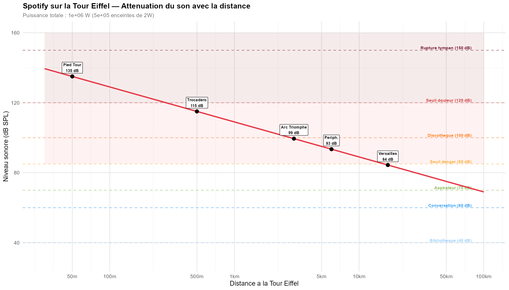

Il faut s'éloigner à près de **20 km** de la Tour pour retrouver un niveau comparable à celui d'une conversation normale (60 dB). Paris intra-muros est, en entier, au-dessus du seuil de danger.

---

## L'immobilier parisien s'effondre

### Le modèle de dépréciation

Les études économiques montrent qu'une augmentation du bruit au-delà de 55 dB entraîne une dépréciation d'environ **0,9% par décibel supplémentaire** sur les prix immobiliers[^nelson]. Au-delà de 100 dB, on considère un bien comme **inhabitable** : sa valeur tombe à zéro.

### Le résultat

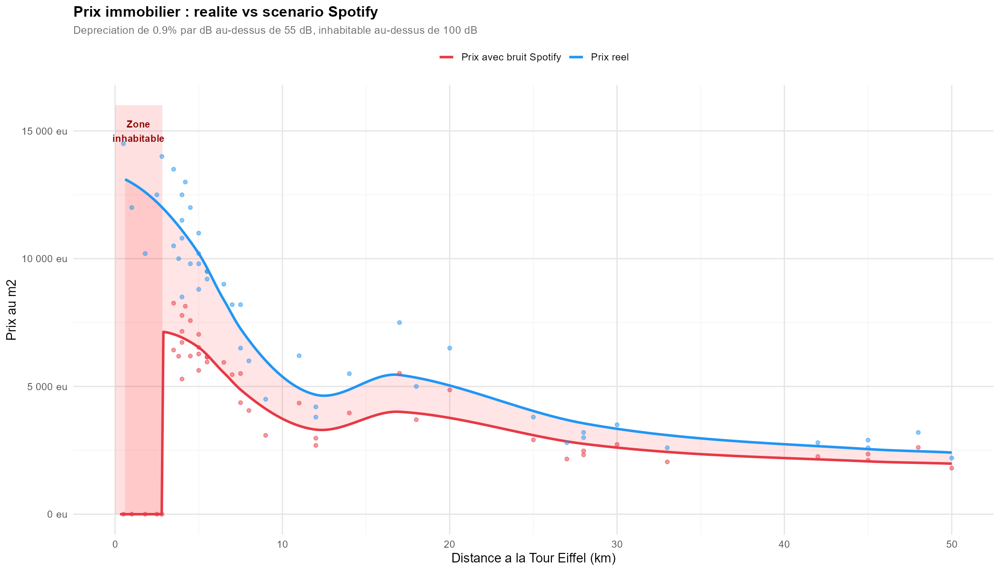

Tous les arrondissements de Paris deviennent inhabitables ou presque. Les beaux quartiers du 7e, 16e et 6e — parmi les plus chers de France — voient leur valeur tomber à **zéro**. Même en banlieue proche, les prix s'effondrent de 30 à 80%[^dvf].

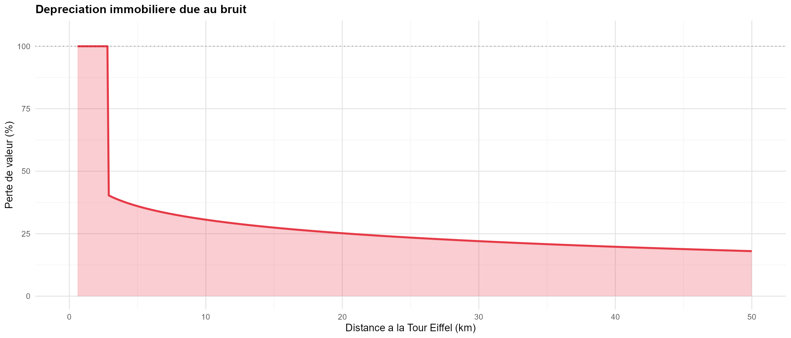

Seules les communes situées à plus de 20 km conservent l'essentiel de leur valeur. Versailles, malgré ses 17 km de distance, subit encore une perte significative.

### Carte de l'effondrement immobilier

Sur la carte ci-dessous, chaque arrondissement et commune est positionné géographiquement. La couleur indique le pourcentage de perte de valeur, la taille du point le prix initial au m². Plus on est proche de la Tour, plus c'est violet foncé : inhabitable.

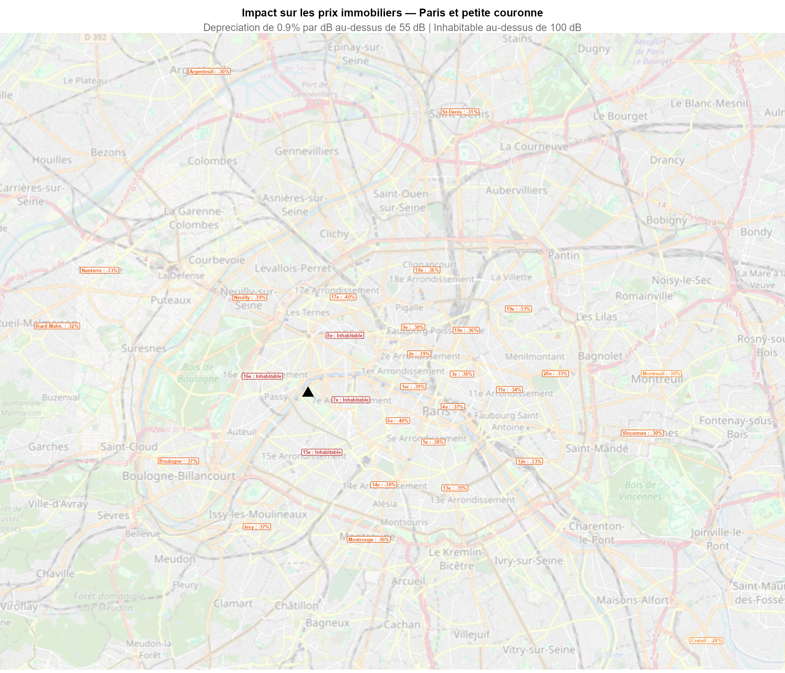

En élargissant la vue à l'Île-de-France, on voit la dépréciation se propager bien au-delà du périphérique. Même des villes comme Melun (45 km), Senlis (45 km) ou Rambouillet (48 km) subissent encore des pertes significatives. Il faut aller jusqu'à Chartres (80 km) ou Beauvais (70 km) pour retrouver des prix presque intacts.

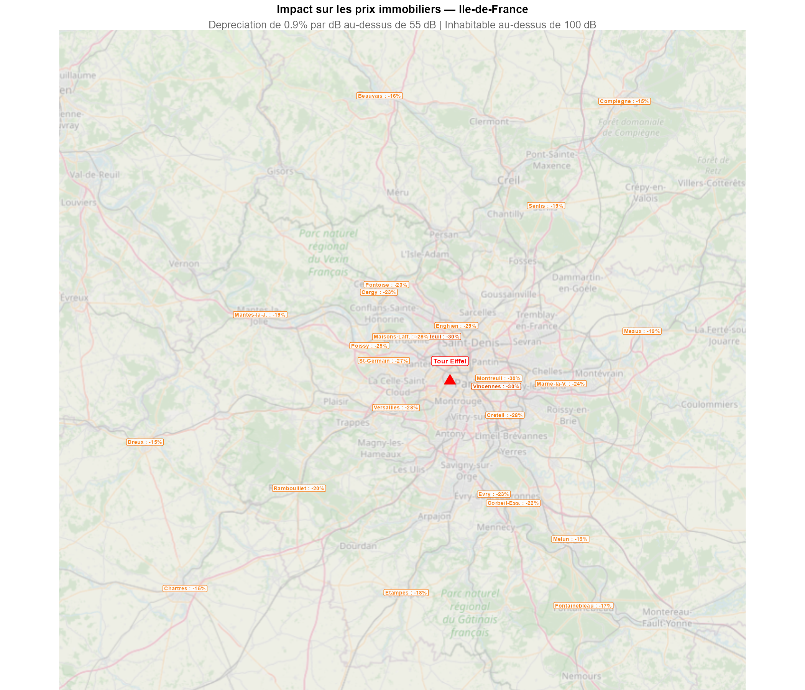

---

## La Tour Eiffel, juke-box géant

### Répartition par genre musical

Si on était des cochons, chaque haut-parleur diffuserait aléatoirement des chansons les unes à la suite des autres et ce mélange ferait une sorte de bruit blanc. Mais comme on est sympa, on respecte les proportions réelles d'écoute Spotify en France[^snep] et chaque (groupe de) haut-parleurs sera spécialisé dans un type de musique. Chaque genre se voit attribuer un **quadrant** de la Tour Eiffel, proportionnel à sa part d'écoute.

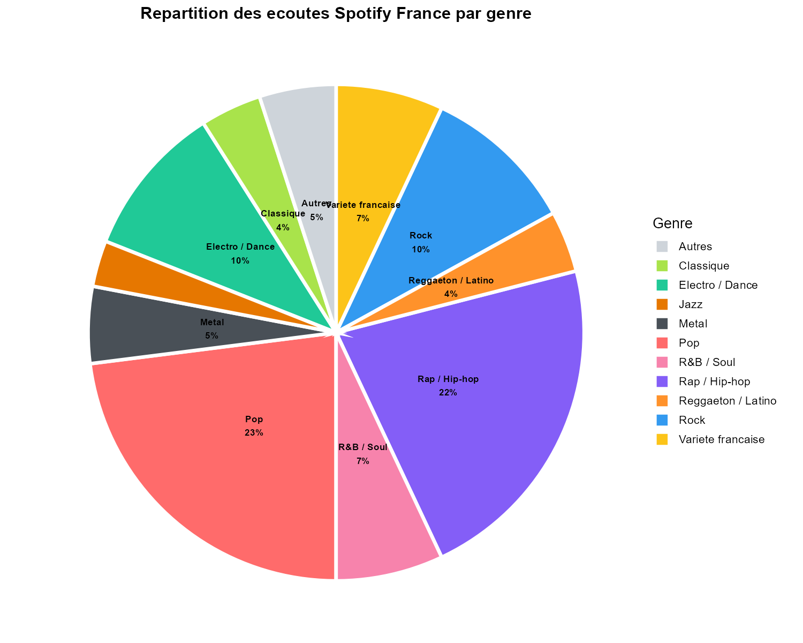

Le rap/hip-hop et la pop dominent largement, suivis du rock et de l'électro. Le métal représente 5% des écoutes, le classique 4%.

### Les quadrants de la Tour

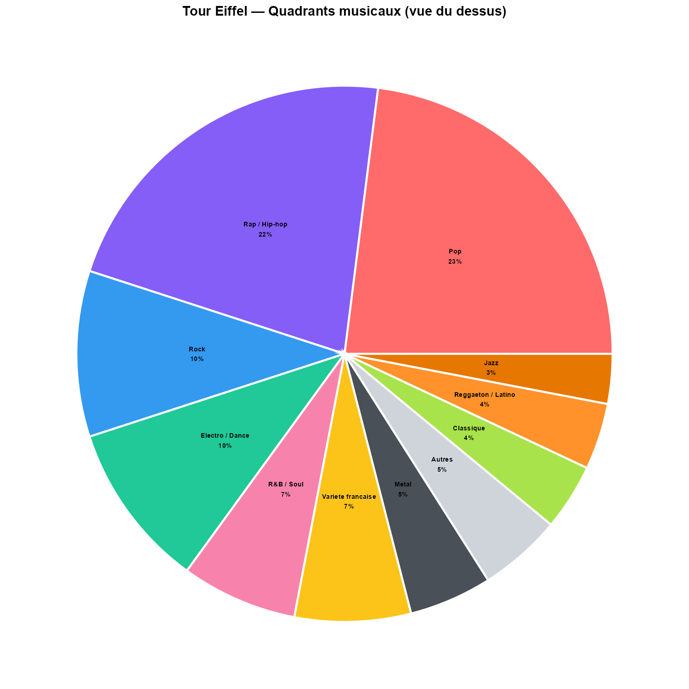

Chaque secteur angulaire de la Tour Eiffel diffuse un genre différent. La puissance émise dans chaque direction est proportionnelle à la part d'écoute du genre.

---

## Le son n'est pas le même dans toutes les directions

### Les profils fréquentiels

Chaque genre musical a un **profil fréquentiel** différent[^tzanetakis]. Le métal et le rap ont beaucoup d'énergie dans les basses fréquences (< 200 Hz), tandis que le classique et le jazz sont davantage concentrés dans les médiums et les aigus.

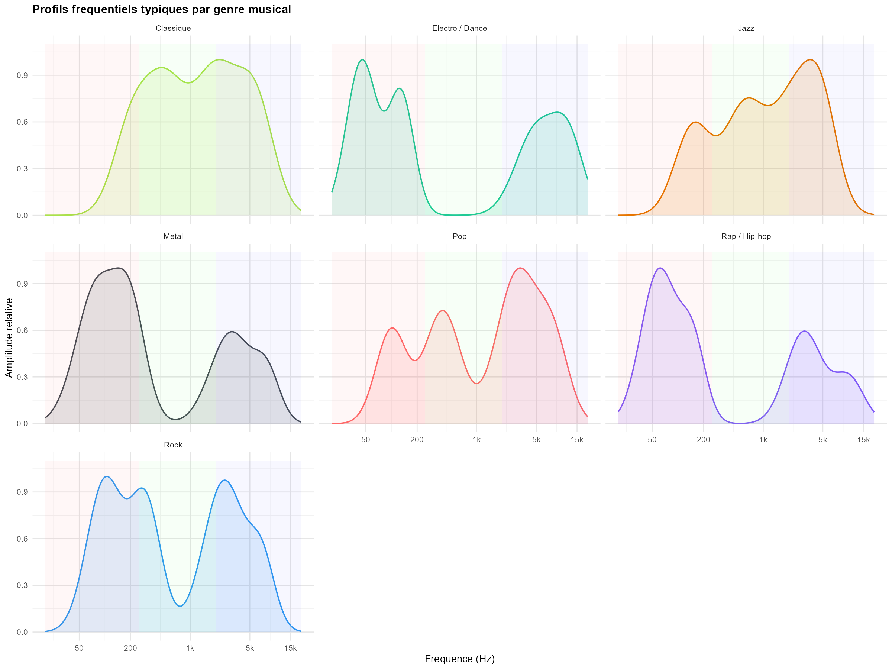

### L'absorption atmosphérique

C'est là où les choses deviennent asymétriques. L'air absorbe les sons différemment selon leur fréquence :

- À **100 Hz** (basses) : seulement **0,2 dB/km** d'absorption
- À **1 000 Hz** (médiums) : **2,8 dB/km**
- À **8 000 Hz** (aigus) : **25 dB/km**[^iso]

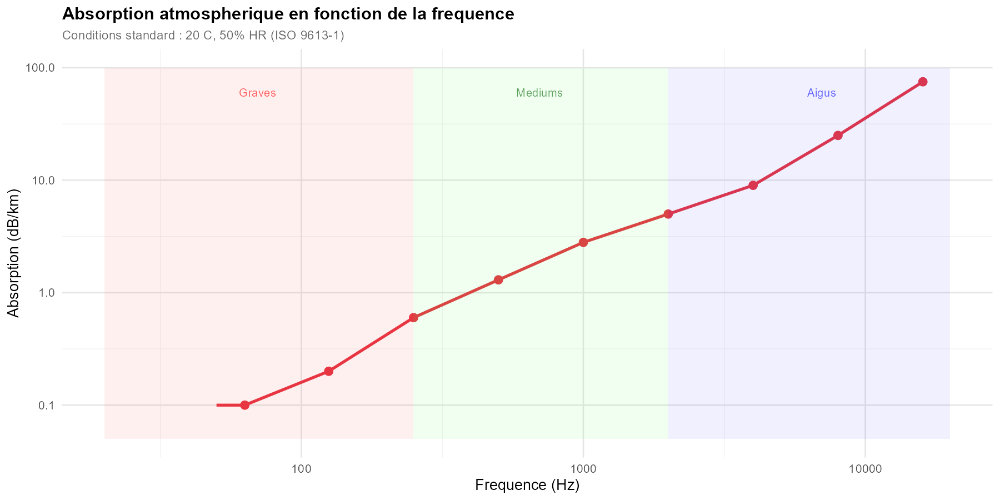

Les basses fréquences traversent l'air presque sans perte. Les aigus sont absorbés très rapidement. Conséquence : **le son du métal et du rap porte beaucoup plus loin** que celui du classique ou du jazz.

### Niveau sonore par genre, avec absorption

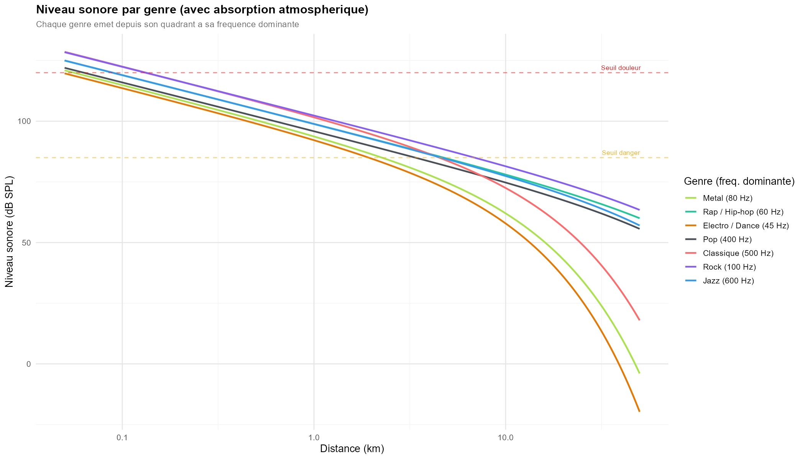

À 10 km, le quadrant métal est encore au-dessus de 85 dB (dangereux), tandis que le quadrant classique est déjà retombé sous les 70 dB. La zone de danger n'est pas un cercle : c'est une **forme asymétrique**, étirée dans la direction des basses fréquences.

---

## Même les sourds ne sont pas à l'abri

### La pression acoustique et les vibrations

Les personnes sourdes n'entendent pas le son par l'oreille. Mais les basses fréquences ne sont pas qu'un phénomène auditif : ce sont des **ondes de pression** qui font vibrer les murs, les planchers, et le corps humain.

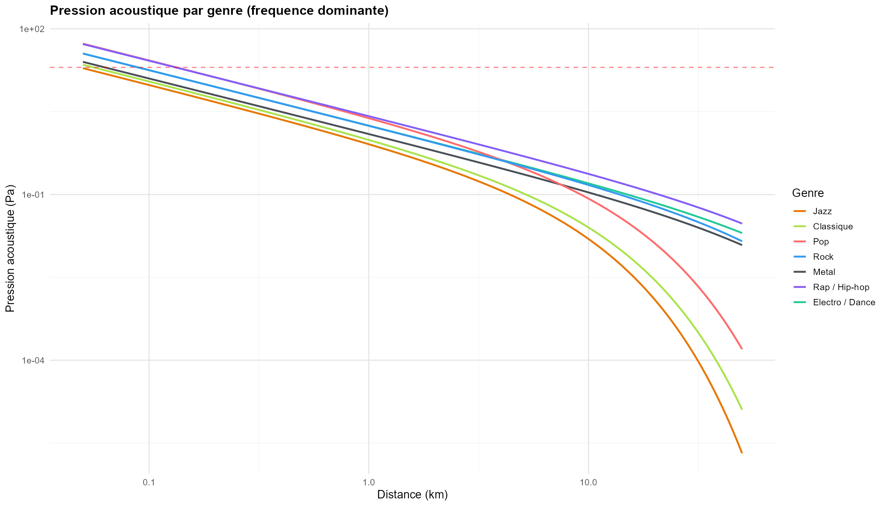

À partir de **110 dB** dans les basses fréquences, les vibrations sont ressenties physiquement[^vibro]. Les sourds ne pourraient donc pas vivre tranquillement dans le quadrant métal ou rap, même s'ils n'entendent rien.

### Des immeubles qui s'effondrent

Les basses fréquences sont particulièrement destructrices pour les bâtiments. Les longueurs d'onde sont comparables aux dimensions des structures, ce qui peut provoquer des **résonances** :

- **140 dB** : fissures dans le plâtre
- **150 dB** : fenêtres brisées, structures légères endommagées
- **160 dB** : dommages structurels sérieux
- **170 dB** : effondrement de maçonnerie[^struct]

Le quadrant métal, avec ses 80 Hz dominants, provoquerait des dégâts structurels sur plusieurs kilomètres. Le quadrant classique, avec ses fréquences plus hautes, verrait ses vibrations absorbées beaucoup plus vite.

En revanche, côté classique et jazz, les vibrations s'atténuent bien plus rapidement. Un sourd pourrait théoriquement habiter plus près de la Tour dans cette direction — à condition que l'immeuble tienne debout.

---

## La carte de Paris, déformée par la musique

### Zone de danger (> 85 dB)

La carte suivante montre, pour chaque direction, la distance à laquelle le niveau sonore reste dangereux (> 85 dB). La forme est **asymétrique** : les genres à basses fréquences (métal, rap, électro) projettent le danger beaucoup plus loin.

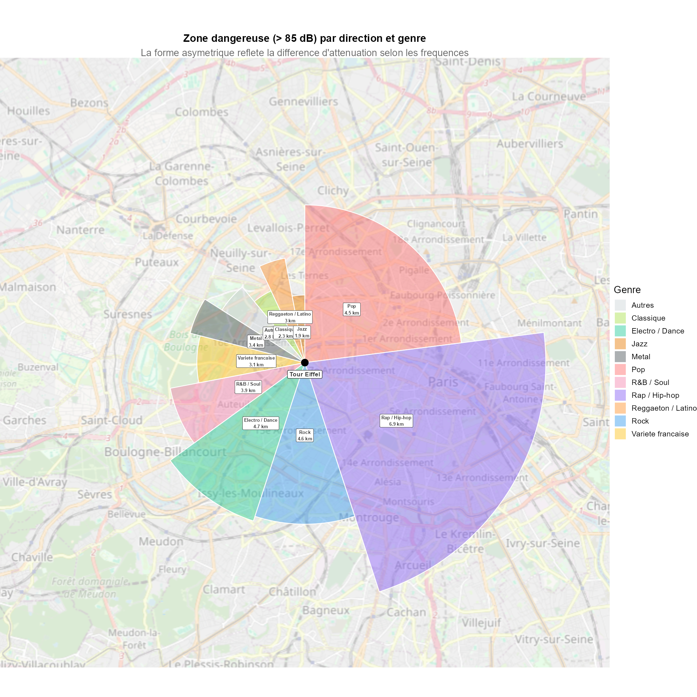

### Zone invivable pour les sourds

En ne regardant que les vibrations basses fréquences (> 110 dB), on obtient une carte très différente. Seuls les genres à basses fréquences créent des zones d'exclusion significatives.

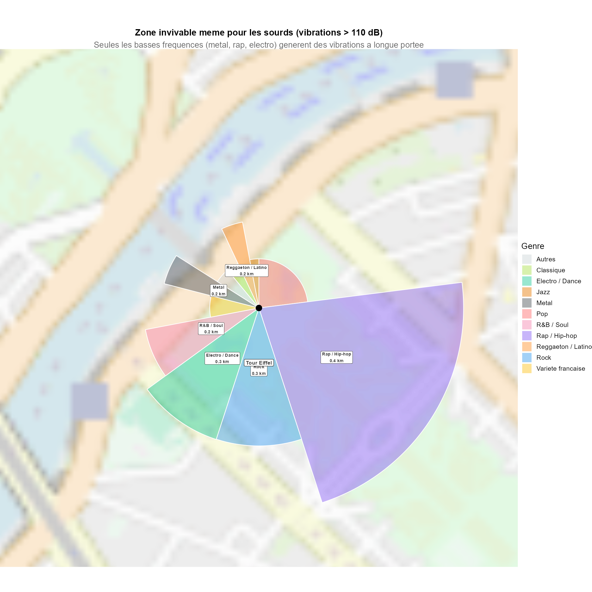

### Vue d'ensemble : Paris sous le bruit

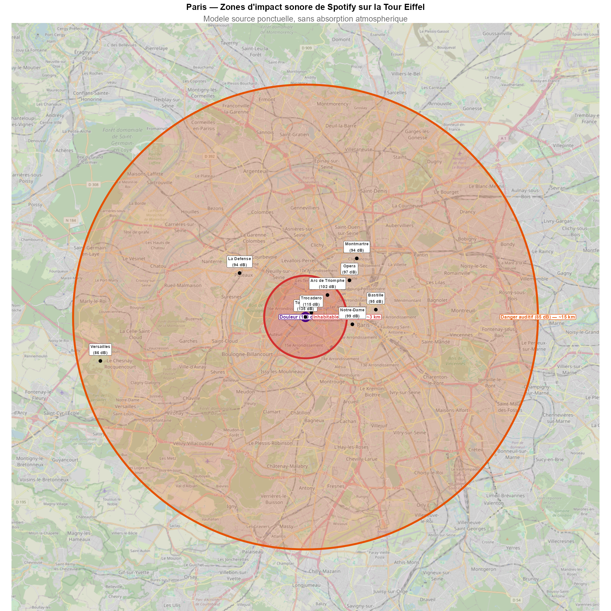

---

## La zone de Jul

### L'artiste le plus écouté de France

Jul a dépassé les **10 milliards de streams cumulés** sur Spotify[^jul], soit environ 1,5 à 2 milliards par an. Avec une durée moyenne de ~3 minutes par morceau, cela représente **75 à 100 millions d'heures d'écoute par an** — soit environ **1,5%** de l'écoute totale Spotify en France (4,4 milliards d'heures/an). Rapporté à notre installation :

- **7 500 enceintes** dédiées exclusivement à Jul
- **15 000 watts** de Jul pur
- C'est l'équivalent d'un gros concert de rock... rien que pour un seul artiste

### Le sous-quadrant Jul

Jul étant un rappeur, ses enceintes se trouvent dans le **quadrant rap/hip-hop** de la Tour. Il occupe environ 7% du secteur rap (1,5% / 22%), soit un mince sous-secteur angulaire.

Mais la musique de Jul est dominée par les **basses profondes** (808, sub-bass autour de 70 Hz), qui se propagent très loin grâce à la faible absorption atmosphérique. Résultat : la zone dangereuse de Jul seul (> 85 dB) s'étend sur environ **2 km**.

### La carte des rues de Jul

Sur cette carte ultra-zoomée, on voit le sous-secteur Jul en rouge, à l'intérieur du quadrant rap (en violet). Les rues couvertes par la zone de Jul sont clairement identifiables au niveau du Champ-de-Mars et des rues avoisinantes.

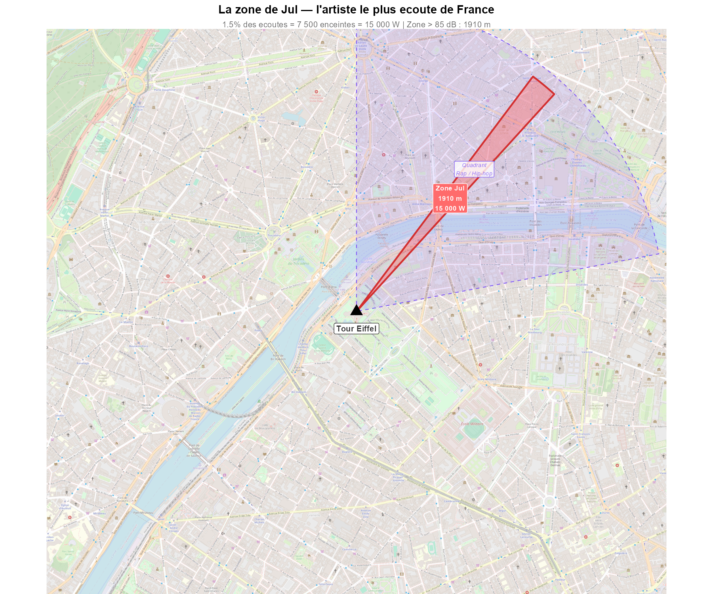

À l'échelle d'un quartier, Jul à lui seul produit un niveau sonore comparable à celui d'un orchestre symphonique en continu. Les riverains du Champ-de-Mars seraient bercés par du « Bande organisée » 24h/24.

### Jul à pleine puissance : le rayon qui découpe la France

Et si on remplaçait les enceintes Bluetooth par des enceintes de festival (12 000W) ? Jul passerait de 15 000 W à **90 MW**. Son petit secteur de 5,4° devient un rayon de Jul qui découpe le nord de la France :

| Enceinte | Puissance Jul | Rayon danger (85 dB) |
|----------|--------------|---------------------|
| 2W (actuel) | 15 kW | ~2 km |
| 2 000W (concert) | 15 MW | ~38 km |
| 12 000W (festival) | 90 MW | ~65 km |

Même à 70 Hz, l'absorption atmosphérique finit par compter sur de longues distances (0,11 dB/km). Mais le résultat reste spectaculaire : à 12 000W, ce mince rayon de 5,4° s'étend sur **65 km** au nord de Paris. Toute la frange sud de la Picardie serait exposée à des niveaux dangereux de Jul — et *uniquement* de Jul. Les habitants entendraient une basse 808 sourde et continue, 24 heures sur 24, sans savoir pourquoi.

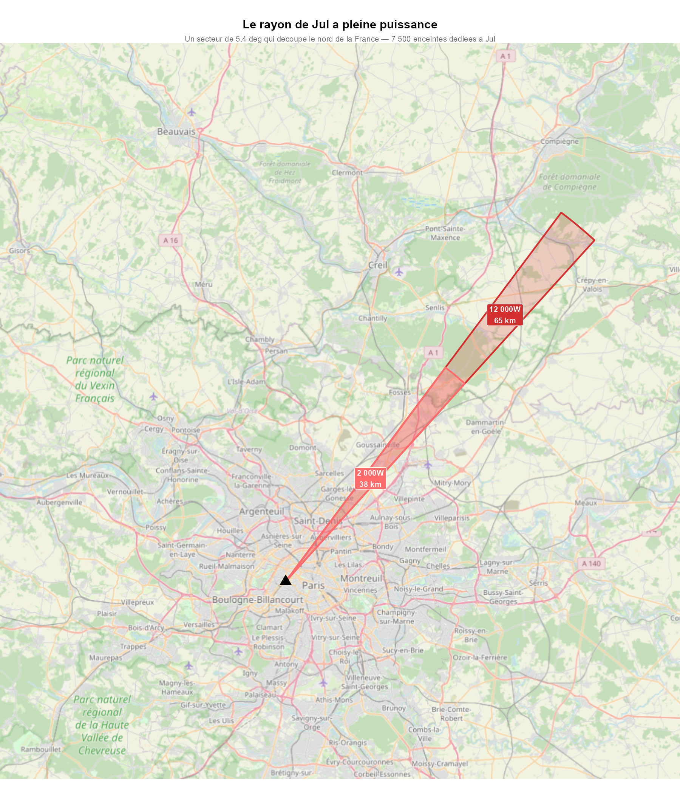

---

## Et si on montait le volume ?

### Le choix de l'enceinte change tout

Jusqu'ici, on a utilisé de modestes enceintes Bluetooth de **2 watts**. Mais il existe des enceintes bien plus puissantes, qui vont jusqu'à **12 000 watts**. Que se passe-t-il si on remplace nos 500 000 petites enceintes par des monstres ?

Vous vous souvenez de Marty McFly dans l'intro de *Retour vers le futur*, qui branche sa guitare sur un ampli géant, joue une note et décolle en arrière ? C'est un peu l'idée. Sauf qu'ici, c'est tout Paris qui décolle.

### Mais d'abord : est-ce que ça rentre ?

Nos petites enceintes Bluetooth de 10×10 cm tenaient confortablement sur la Tour (2,5% de la surface, 2% du poids). Mais une enceinte de concert fait **50×50 cm** et pèse **35 kg**. Faisons le calcul :

| Type d'enceinte | Dimensions | Poids unitaire | Surface totale | Poids total | vs Tour (200 000 m², 7 300 t) |
|-----------------|-----------|---------------|----------------|-------------|-------------------------------|
| Bluetooth (2W) | 10×10 cm | 0,3 kg | 5 000 m² | 150 t | **ça rentre** (2,5% surface) |
| Salon (20W) | 20×15 cm | 2 kg | 15 000 m² | 1 000 t | ça rentre (7,5% surface) |
| Sono (200W) | 35×30 cm | 15 kg | 52 500 m² | 7 500 t | ça rentre (26% surface, poids = Tour) |
| Concert (2 000W) | 50×50 cm | 35 kg | 125 000 m² | 17 500 t | **63% surface**, 2,4× le poids |
| Festival (12 000W) | 80×80 cm | 80 kg | 320 000 m² | 40 000 t | **1,6× la surface**, 5,5× le poids |

En surface, la Tour tient jusqu'aux enceintes de concert — mais le **poids** devient le vrai problème. À 200W, les enceintes pèsent déjà autant que la charpente. À 2 000W, les 17 500 tonnes feraient plier la structure. Et à 12 000W, les 40 000 tonnes d'enceintes pèsent **5,5 fois la Tour elle-même**.

### Alternative : un cylindre géant

Puisque la Tour ne suffit plus, imaginons qu'on empile les enceintes sur la paroi extérieure d'un **cylindre de 50 m de diamètre** (circonférence ≈ 157 m) :

| Type d'enceinte | Par anneau | Anneaux | **Hauteur du cylindre** | vs Tour Eiffel |
|-----------------|-----------|---------|------------------------|----------------|
| Bluetooth (2W) | 1 570 | 319 | **32 m** | 10% de la Tour |
| Salon (20W) | 785 | 637 | **96 m** | Premier étage |
| Sono (200W) | 449 | 1 114 | **335 m** | La Tour pile ! |
| Concert (2 000W) | 314 | 1 592 | **796 m** | 2,4× (dépasse le Burj Khalifa) |
| Festival (12 000W) | 196 | 2 551 | **2 041 m** | 6,2× (une colonne de 2 km) |

Coïncidence magnifique : les enceintes de sono empilées font **exactement la hauteur de la Tour Eiffel**. Les enceintes de concert dépassent le Burj Khalifa, et les enceintes de festival forment une colonne de **2 kilomètres de haut** visible depuis toute l'Île-de-France.

Mais bon, on ne va pas se laisser arrêter par un détail logistique.

### Les rayons d'impact

Ces rayons sont calculés avec la loi en $1/r^2$ **sans absorption atmosphérique** — c'est le pire cas théorique. En pratique, l'absorption réduit significativement la portée, surtout pour les fréquences élevées. Les cartes par genre (plus bas) montrent les distances réelles avec absorption.

| Type d'enceinte | Puissance totale | Rayon danger (85 dB)* | Rayon douleur (120 dB)* |
|-----------------|-----------------|---------------------|----------------------|
| Bluetooth (2W) | 1 MW | ~15 km | ~1 km |
| Salon (20W) | 10 MW | ~47 km | ~3 km |
| Sono (200W) | 100 MW | ~150 km | ~9 km |
| Concert (2 000W) | 1 GW | ~470 km | ~30 km |
| Festival (12 000W) | 6 GW | ~1 170 km | ~78 km |

*\*sans absorption atmosphérique*

### La consommation en réacteurs nucléaires

Un réacteur nucléaire produit environ **900 MW**[^nuc]. Voici ce qu'il faut pour alimenter nos enceintes :

| Type d'enceinte | Puissance totale | Réacteurs nucléaires | Part de la production française |
|-----------------|-----------------|---------------------|-------------------------------|
| Bluetooth (2W) | 1 MW | 0,001 (un millième) | ~0,002% |
| Salon (20W) | 10 MW | 0,01 | ~0,02% |
| Sono (200W) | 100 MW | 0,11 | ~0,15% |
| Concert (2 000W) | 1 GW | **1,1** | ~1,6% |
| Festival (12 000W) | 6 GW | **6,7** | ~9,6% |

Avec les enceintes de concert, il faut **un réacteur nucléaire dédié** rien que pour diffuser Spotify sur la Tour Eiffel. Avec les enceintes de festival, on mobilise **presque 7 réacteurs** — soit plus de 10% du parc nucléaire français (56 réacteurs) pour faire du bruit. En énergie, ça représente **144 GWh par jour**, de quoi alimenter une ville de 2 millions d'habitants.

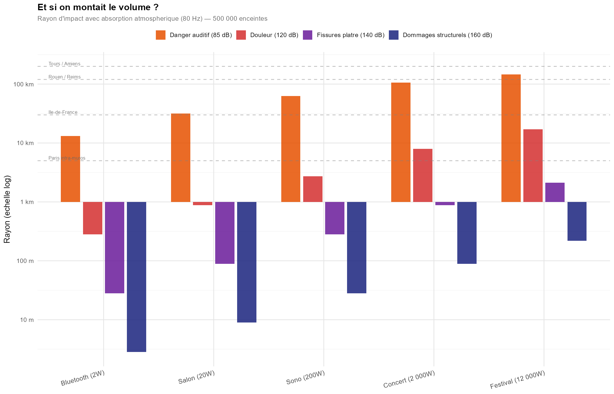

### La carte de France à 2 000W

À 2 000W par enceinte, la carte des zones dangereuses (> 85 dB) par genre n'est plus un plan de Paris — c'est une carte de France. On retrouve la forme asymétrique : le métal et le rap, avec leurs basses fréquences, découpent la France sur des centaines de kilomètres, tandis que le classique et le jazz ne dépassent pas l'Île-de-France.

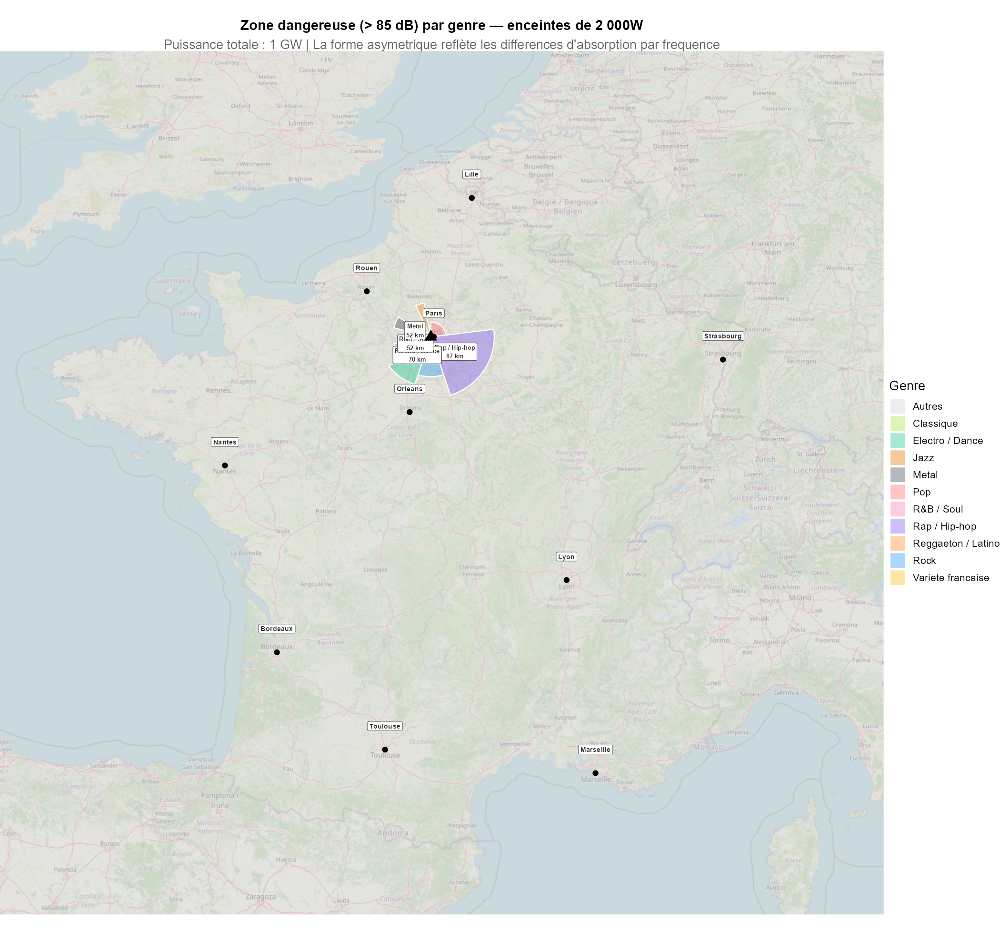

### Des immeubles qui s'effondrent à des kilomètres

Avec nos petites enceintes de 2W, les dommages structurels (fissures, fenêtres brisées) restaient confinés à quelques mètres du pied de la Tour. Mais en montant la puissance, la zone de destruction s'étend considérablement — surtout dans le quadrant métal, où les basses fréquences (80 Hz) ne sont quasiment pas absorbées par l'air.

À **2 000W par enceinte** (quadrant métal seul) :

- Fissures dans le plâtre : **~1 km** (tout le 7e arrondissement)
- Fenêtres brisées : **~300 m** (le Champ-de-Mars est un champ de débris)
- Dommages structurels sérieux : **~90 m** (les immeubles les plus proches vacillent)

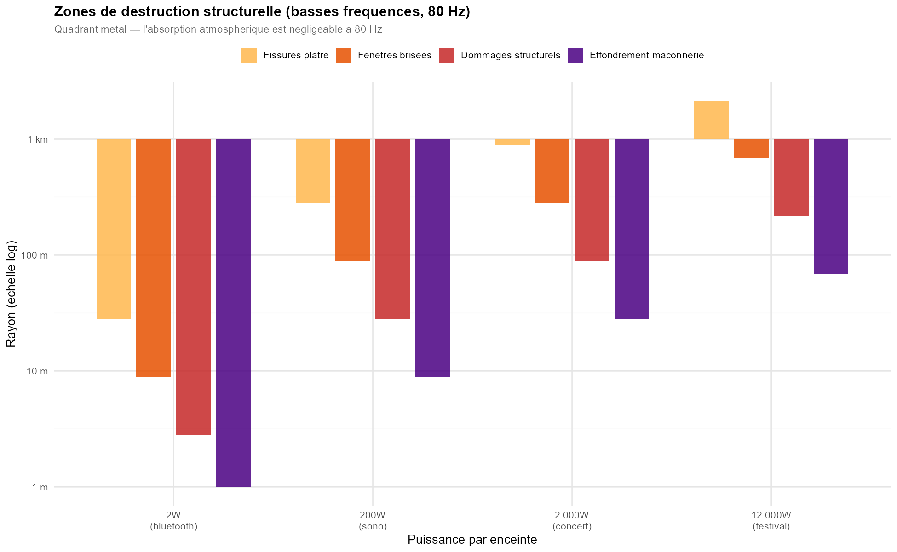

### L'Europe entière sous le bruit

À 12 000W par enceinte, le rayon de danger auditif (85 dB) dépasse **1 000 km**. Londres, Bruxelles, Amsterdam, Barcelone, Milan, Berlin — toutes ces villes sont dans la zone dangereuse. Même Madrid, à plus de 1 000 km, reste au-dessus de 80 dB.

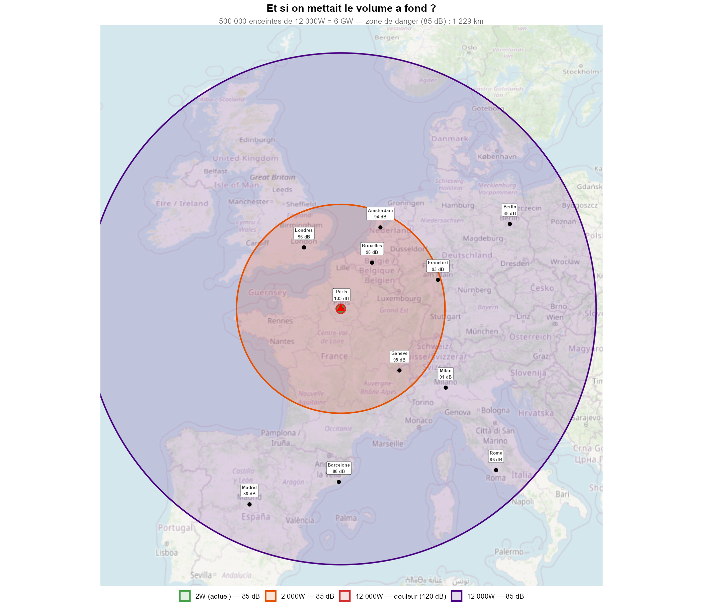

On passe d'une catastrophe parisienne à une catastrophe continentale. L'Europe occidentale entière serait inhabitable, et il faudrait aller jusqu'à Moscou ou Marrakech pour retrouver un niveau sonore acceptable.

---

## En résumé

| | Valeur |
|---|---|
| Écoute Spotify France / jour | 12 000 000 heures |
| Flux simultanés | 500 000 |
| Enceintes 2W | 500 000 |
| Puissance totale | 1 000 000 W |
| Seuil de douleur atteint à | ~1 km |
| Seuil de danger atteint à | ~15 km |
| Conversation normale à | ~50 km |

Paris est entièrement inhabitable. L'immobilier s'effondre. Les sourds sont épargnés côté classique mais pas côté métal. Et la Tour Eiffel, elle, tient le coup.

---

## Sources

[^spotify]: Spotify comptait 675 millions d'utilisateurs actifs mensuels fin 2024 (Spotify Earnings Q4 2024). La France représente environ 3,5% du marché mondial, soit ~24 millions d'utilisateurs. Le SNEP rapporte 122 milliards d'écoutes en streaming en France en 2024. Voir [SNEP, Les Chiffres](https://www.snepmusique.com/les-chiffres/).

[^ecoute]: Spotify rapporte un temps d'écoute moyen d'environ 30 minutes par jour et par utilisateur dans ses rapports trimestriels. Cette estimation est cohérente avec les données IFPI (*Global Music Report*).

[^tour]: Tour Eiffel : charpente métallique de 7 300 tonnes, poids total 10 100 tonnes, hauteur 330 m, surface à peindre 200 000 m². Source : [site officiel, chiffres clés](https://www.toureiffel.paris/fr/le-monument/chiffres-cle) et [Wikipédia, données techniques](https://fr.wikipedia.org/wiki/Donn%C3%A9es_techniques_de_la_tour_Eiffel).

[^kinsler]: Kinsler L.E. et al., *Fundamentals of Acoustics*, 4e éd., Wiley (2000). La loi de l'inverse du carré ($I = P/4\pi r^2$) est le modèle standard pour une source ponctuelle en champ libre.

[^inrs]: INRS, *Bruit en milieu de travail* : l'ouïe est en danger à partir de 80 dB sur 8h, danger immédiat au-dessus de 135 dB. Le seuil de douleur est généralement situé autour de 120-130 dB. Voir [inrs.fr](https://www.inrs.fr/risques/bruit/ce-qu-il-faut-retenir.html). Voir aussi OMS, *Guidelines for Community Noise* (1999).

[^nelson]: Nelson J.P., *Meta-analysis of airport noise and hedonic property values*, Journal of Transport Economics and Policy, vol. 38, n° 1 (2004). Cette méta-analyse de 33 études trouve un indice de dépréciation moyen (NSDI) de 0,5% à 2% par dB au-dessus du bruit ambiant. Nous utilisons 0,9%, valeur médiane de la littérature.

[^snep]: Répartition par genre estimée à partir des données SNEP (*Bilan du marché de la musique*), des classements Spotify France et de la littérature sur les habitudes d'écoute françaises. Les proportions exactes ne sont pas publiées par Spotify et constituent des estimations.

[^iso]: ISO 9613-1:1993, *Acoustics — Attenuation of sound during propagation outdoors — Part 1: Calculation of the absorption of sound by the atmosphere*. Norme internationale de référence pour l'absorption atmosphérique, conditions standard 20°C, 50% HR.

[^vibro]: Le seuil de perception vibrotactile des basses fréquences se situe autour de 100-110 dB SPL. Voir : Verrillo R.T., *Vibration Sensation in Humans*, Perception & Psychophysics (1966) ; et la synthèse dans Russo F.A. et al., *Vibrotactile Sensitivity of the Foot*, Ear and Hearing (2020).

[^struct]: Les seuils de dommages structurels par ondes acoustiques proviennent de la littérature sur les bangs soniques et les vibrations industrielles. Voir : Bachmann H. et al., *Vibration Problems in Structures*, Birkhäuser (1995). Les valeurs exactes (140-170 dB) sont des ordres de grandeur issus de la littérature, pas des seuils normés.

[^jul]: Jul a dépassé les 10 milliards de streams cumulés sur Spotify (visible sur sa page artiste). Avec une durée moyenne de ~3 min par morceau et un volume annuel estimé à 1,5-2 milliards de streams, cela représente 75-100 millions d'heures/an, soit ~1,5% du total français (4,4 milliards d'heures/an, source SNEP : 122 milliards de streams en 2024).

[^dvf]: Prix immobiliers par arrondissement : base DVF (Demandes de Valeurs Foncières), données publiques. Voir [app.dvf.etalab.gouv.fr](https://app.dvf.etalab.gouv.fr/).

[^nuc]: Un réacteur nucléaire français produit en moyenne 900 MW à 1 450 MW de puissance électrique. Source : EDF, [Le parc nucléaire EDF](https://www.edf.fr/groupe-edf/premier-electricien-mondial/nos-energies/energies-nucleaires/le-parc-nucleaire-edf).

[^tzanetakis]: Tzanetakis G. & Cook P., *Musical Genre Classification of Audio Signals*, IEEE Transactions on Speech and Audio Processing, vol. 10, n° 5 (2002). Les profils spectraux par genre utilisés dans cet article sont des modélisations simplifiées inspirées de cette littérature.

**Code source :** disponible sur [GitHub](https://github.com/AAudes/Spotify_tour_eiffel).
